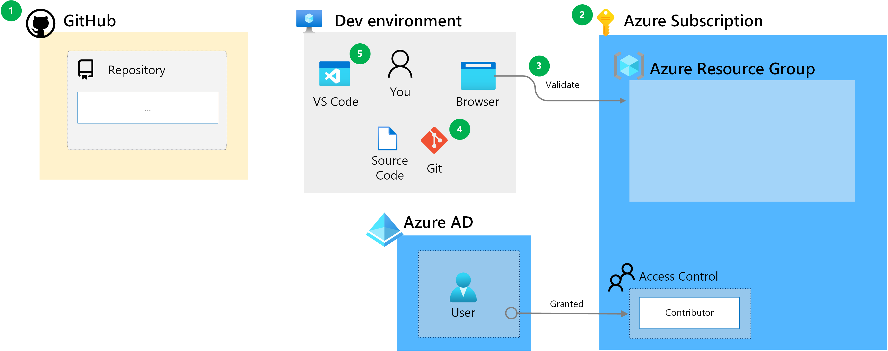

# What The Hack: DevOps with GitHub

## Challenge 0 - Setup

[Home](../readme.md) - [Next >](challenge01.md)

### Introduction

DevOps is a broad concept that encompasses people, processes, and tools. The tools you use fall into a number of categories, including version control, Continuous Integration and Continuous Deployment (CI/CD), Infrastructure-as-Code, and security scanning. Within each category, you have many choices when it comes to implementation. In this challenge, you will set up your local machine and cloud environment with the minimum requirements, but the lessons that follow will translate to any DevOps practice, regardless of tooling. 

The following image illustrates the steps in this challenge

  

### Description

1. Begin by creating a GitHub account and repository that you can use for this hack. You may use an existing account if you have one already.

2. Next, create an Azure subscription that you can use for this hack. If you already have a subscription, you may use it. Alternatively, you can get a free trial subscription [here](https://azure.microsoft.com/en-us/free/).

3. Log in to the [Azure Portal](http://portal.azure.com) to confirm that you have an active subscription that you can deploy resources to. 

4. Additionally, you will need to install a Git client. Two of the most popular ways of working with GitHub are the Git command line tool and GitHub Desktop (you only need one):

    - If you are comfortable with command line interfaces and want to try Git SCM, follow instructions to download and install [here](https://git-scm.com/downloads). 
    - If you prefer a GUI-based experience, download and install GitHub Desktop [here](https://desktop.github.com/). 
    - There is also built-in Git SCM in Visual Studio Code. See [Using Git source control in VS Code](https://code.visualstudio.com/docs/sourcecontrol/overview) for details. 

5. Finally, you will need some version of IDE or text editor to complete the challenges. You are welcome to use built in applications such as TextEdit or Notepad, though we highly recommend development tools such as [Visual Studio Code](https://code.visualstudio.com/) or [Atom](https://atom.io/). Follow the links to download and install, or use an editor of your choice!

### Success Criteria

- You should now be able to login to both GitHub and Azure with valid accounts for each service. 
- You should have a new initialized repo in GitHub.
- You should also have installed your preferred git client. 
- You should have a text editor installed. 

### Learning Resources

- There are many other GUI-based Git clients aside from GitHub Desktop. Feel free to explore them [here](https://git-scm.com/downloads/guis). 
- If using VSCode as your editor, you can check [here](https://code.visualstudio.com/docs/editor/github) to learn more about the built-in Git capabilities, and integration with GitHub. Feel free to use VSCode's Git features instead of the command line or GUI client. 
- [What is DevOps?](https://docs.microsoft.com/en-us/azure/devops/learn/what-is-devops)
- [What is GitHub?](https://guides.github.com/activities/hello-world/)
- [Azure DevOps vs. GitHub](https://acloudguru.com/blog/engineering/azure-devops-vs-github-comparing-microsofts-devops-twins)
- [GitHub Learning Lab](https://github.com/apps/github-learning-lab)

[Home](../readme.md) - [Next >](challenge01.md)
