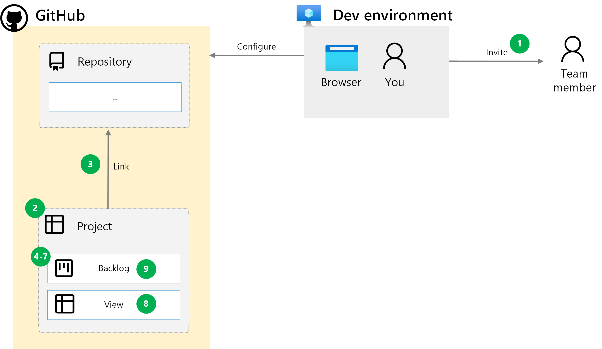

# What The Hack: DevOps with GitHub

## Challenge 1 - Track your work with GitHub project boards

[< Previous](challenge00.md) - [Home](../readme.md) - [Next >](challenge02.md)

### Introduction

Agile project management is a key component of building a modern DevOps culture at your organization. If you are new to Agile or just want a refresher, we recommend you review the following articles:

1. [What is Agile?](https://docs.microsoft.com/en-us/azure/devops/learn/agile/what-is-agile)
2. [What is Scrum?](https://docs.microsoft.com/en-us/azure/devops/learn/agile/what-is-scrum)
3. [What is Kanban?](https://docs.microsoft.com/en-us/azure/devops/learn/agile/what-is-kanban)
4. [What is Agile Development?](https://docs.microsoft.com/en-us/azure/devops/learn/agile/what-is-agile-development)

To help you with Agile project management, there is [GitHub project boards](https://docs.github.com/en/issues/planning-and-tracking-with-projects/learning-about-projects/about-projects). With GitHub project boards, you can quickly and easily start tracking your backlog, tasks, issues/bugs and features associated with your project.  

Review the following introduction to GitHub project boards: [GitHub project boards](https://docs.github.com/en/issues/planning-and-tracking-with-projects/learning-about-projects/about-projects).

The following image illustrates the areas covered in this challenge

  

### Challenge

1. Add collaborators from your team to your repo. 

2. Create a new project using the "Team backlog" template.

3. Ensure your project is with linked with your repository

4. Create a draft issue for this challenge and each of the remaining challenges (i.e., create 9 issues total - skip challenge 0). When creating each issue, make sure to:
    - Assign an owner for each issue from your team. 
    - Convert the `challenge 1` draft issue to an issue and select our repository. Look at the difference between a draft and your converted `challenge 1` issue

5. Move all your issues to the "Ready" column and convert each one from draft to an issue.

6. Since you are currently working on Challenge 1, drag the `Challenge 1` issue to the "In progress" column.

7. Ask your team member to close the `Challenge 1` issue you assigned to them. Review your project board to see if the issue moved to the 'Done' column automatically. 

8. Create a new view to show your challenge issues in a table view. 

9. Add a custom field to your issue. The custom field can be called Complexity and will be a single select type with the options (Very Easy, Easy, Hard and Very Hard).

10. After you complete each of the following challenges, be sure to close each associated issue. 

### Success Criteria

- You have added one or more collaborators to your repo
- You have a project board using the automation kanban template with 9 issues (8 open, 1 closed by a team member)
- New issues appear under the "New" column
- Closed issues automatically appear under the "Done" column
- You will have a table view in addition to your Backlog Board
- You will have a custom field called Complexity on your issues

### Learning Resources

- [Creating a project board in GitHub](https://docs.github.com/en/issues/planning-and-tracking-with-projects/creating-projects/creating-a-project)
- [Enable GitHub Issues on a repo](https://docs.github.com/en/free-pro-team@latest/github/managing-your-work-on-github/disabling-issues)
- [Inviting collaborators to a personal repository](https://docs.github.com/en/free-pro-team@latest/github/setting-up-and-managing-your-github-user-account/inviting-collaborators-to-a-personal-repository)
- [Learn more about automation with project boards](https://docs.github.com/en/issues/planning-and-tracking-with-projects/automating-your-project/using-the-built-in-automations)
- [Adding issues to a project](https://docs.github.com/en/issues/planning-and-tracking-with-projects/managing-items-in-your-project/adding-items-to-your-project)
- [Customizing views](https://docs.github.com/en/issues/planning-and-tracking-with-projects/customizing-views-in-your-project/customizing-a-view)
- [About single select fields](https://docs.github.com/en/issues/planning-and-tracking-with-projects/understanding-fields/about-single-select-fields)

### Advanced Challenges (optional)

1. Use the [GitHub CLI](https://cli.github.com/manual/index) to create issue #9. Once, you have created the issue, use the CLI to close the issue.

[< Previous](challenge00.md) - [Home](../readme.md) - [Next >](challenge02.md)
