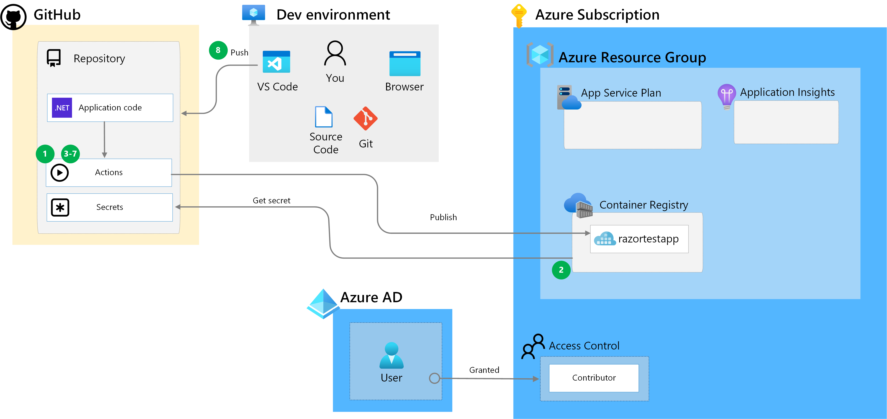

# What The Hack: DevOps with GitHub

## Challenge 5 - Build and push Docker image to container registry

[< Previous](challenge04.md) - [Home](../readme.md) - [Next >](challenge06.md)

### Introduction

Now, we need to extend our workflow with steps to build a docker image and push it to Azure Container Registry (ACR). In the NEXT challenge, we will configure the Web App to pull the image from ACR.

Containers are a great way to package and deploy applications consistently across environments. If you are new to containers, there are 3 key steps to creating and publishing an image - outlined below. Because this is a What The Hack focused on DevOps and not containers, we've strived to make this challenge as straightforward as possible.

1. `docker login` - you need to login to the container registry that you will push your image to. As you can imagine, you don't want anyone to publish an image in your registry, so it is often setup as a private registry...requiring authentication to push and pull images.

2. `docker build` - you need to call docker.exe (running locally on your machine or on your build server) to create the container image. A *critical* component of this is the `Dockerfile`, which gives instructions to docker.exe on how to build the image, the files to copy, ports to expose and startup commands.

3. `docker push` - once you have created your docker image, you need to store it in the container registry, which is our secured and centralized location to store docker images. Docker supports a push command that copies the docker image to the registry in the proper repository. A repository is a logical way of grouping and versioning docker images.

The following image illustrates the areas covered in this challenge

  

### Challenge

In this challenge, you will build and push a docker image to ACR:

1. At the top of your workflow file, create 4 environment variables:

    - `registryName` - the full server address of your ACR instance. Set this to "`registryName`.azurecr.io" - replacing `registryName` with the `<prefix>devopsreg` value as it is defined in your Bicep file. 
    - `repositoryName` - The repository to target in the registry. Set this to "`wth/dotnetcoreapp`".
    - `dockerFolderPath` - The path to the folder that contains the Dockerfile - a critical parameter. You will need to point to the folder: `Application/src/RazorPagesTestSample`.
    - `tag` - This needs to be a unique value each time, as this is used to version the images in the repository. GitHub makes [environment variables](https://docs.github.com/en/free-pro-team@latest/actions/reference/context-and-expression-syntax-for-github-actions#github-context) available that helps with this. Set `tag` to the [github.run_number](https://www.bing.com/search?q=%24%7B%7Bgithub.run_number%7D%7D&form=QBLH&sp=-1&pq=%24%7B%7Bgithub.run_number%7D%7D&sc=0-22&qs=n&sk=&cvid=D84DA66323DC4E14BD794F90FCFD90D3) environment variable.

2. Go to the Azure Portal and get the (1) username and (2) password from your ACR instance and save as GitHub secrets (`ACR_USERNAME`, `ACR_PASSWORD`).

3. Add a second **job** to your existing .NET workflow. 

4. Make sure the first step in your second job includes `- uses: actions/checkout@v2`

5. To authenticate to the registry, add a step named `Docker login` with the following as the `run` command: `docker login $registryName -u ACR_USERNAME -p ACR_PASSWORD` - replacing ACR_USERNAME and ACR_PASSWORD with the secrets.

6. To build your image, add a step named `Docker build` with the following as the `run` command: `docker build -t $registryName/$repositoryName:$tag --build-arg build_version=$tag $dockerFolderPath`

7. To push your image to ACR, add a step named `Docker push` with the following as the `run` command: `docker push $registryName/$repositoryName:$tag`

8. Test the workflow by making a small change to the application code (i.e., add a comment). Commit, push, monitor the workflow and verify that a new container image is built, uniquely tagged and pushed to ACR after each successful workflow run.

### Success Criteria

- A new container image is built, uniquely tagged and pushed to ACR after each successful workflow run.

### Learning Resources

- [Environment variables](https://docs.github.com/en/free-pro-team@latest/actions/reference/workflow-syntax-for-github-actions#env)
- [Introduction to GitHub Actions](https://docs.github.com/en/free-pro-team@latest/actions/learn-github-actions/introduction-to-github-actions)
- [Understanding workflow path filters](https://docs.github.com/en/free-pro-team@latest/actions/reference/workflow-syntax-for-github-actions#onpushpull_requestpaths)
- [Authenticate with an Azure container registry](https://docs.microsoft.com/en-us/azure/container-registry/container-registry-authentication#admin-account)
- [GitHub Actions for Azure](https://github.com/Azure/actions)

### Tips

- If you are having trouble finding a starting point, try clicking over to the 'Actions' tab of your GitHub repository. 
- Take advantage of the prebuilt workflow templates if you find one that might work! 

[< Previous](challenge04.md) - [Home](../readme.md) - [Next >](challenge06.md)
