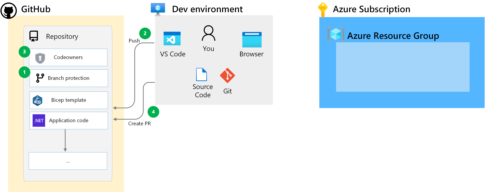

# What The Hack: DevOps with GitHub

## Challenge 7 - Branching and Policies

[< Previous](challenge06.md) - [Home](../readme.md) - [Next >](challenge08.md)

### Introduction

In the previous steps, we successfully implemented an end-to-end CI/CD pipeline! However, our current workflow will immediately promote every small change directly to production. Typically, you would want to avoid working directly against the main branch in your repository to avoid conflicts and protect the production environment. 

With GitHub, we can solve these challenges using a practice called branching. Some may refer to this as the [GitHub flow](https://guides.github.com/introduction/flow/). When a developer wants to make a change, add a feature, or fix a bug, he or she begins by creating a new 'branch' or copy of the main codebase. Then, the developer makes changes and commits them. He or she creates a pull request to merge these changes back into the main branch. This pull request may or may not involve some testing or discussion. Finally, changes are merged back into the main codebase, and the branch can be deleted. 

In this challenge, you will practice this flow. Additionally, GitHub offers a feature for explicitly protecting against changes directly to the main branch. These are called branch protection rules, and you will start by implementing one.

The following image illustrates the areas covered in this challenge

  

### Challenge

1. Create a branch protection rule which prevents developers from commiting changes to the main branch in the repository.

2. Create a feature branch, make a small change to the code (i.e.,`/Application/aspnet-core-dotnet-core/Views/Home/Index.cshtml`), and sync this branch with the GitHub repository.

3. Define a code owner for the `/Application` directory. Your branch policy should require a review from the code owner.

4. Create and complete a Pull Request, merging your code change into the protected branch.

### Success Criteria

- You have a branch protection rule which prevents changes from being commited to your main branch.

- Changes to the application (i.e.,`/Application/aspnet-core-dotnet-core/Views/Home/Index.cshtml`) are committed to a feature branch.

- Before a pull request is completed:
    - A code owner must approve the changes ([hint](https://docs.github.com/en/free-pro-team@latest/github/creating-cloning-and-archiving-repositories/about-code-owners))
    - A CI workflow is run against the feature branch ensuring the application passes a build and test ([hint](https://docs.github.com/en/free-pro-team@latest/github/administering-a-repository/enabling-required-status-checks))

- A completed pull request merges with the protected branch and is automatically deployed to the dev environment.

### Learning Resources

- General information about protected branches can be found [here](https://docs.github.com/en/github/administering-a-repository/about-protected-branches), with more configuration specifics [here](https://docs.github.com/en/github/administering-a-repository/configuring-protected-branches).
- General information about branches can be found [here](https://docs.github.com/en/github/collaborating-with-issues-and-pull-requests/about-branches), with more specifics about creation and deletion [here](https://docs.github.com/en/github/collaborating-with-issues-and-pull-requests/creating-and-deleting-branches-within-your-repository).
- General information about pull requests can be found [here](https://docs.github.com/en/github/collaborating-with-issues-and-pull-requests/about-pull-requests), with more specifics about [creating](https://docs.github.com/en/github/collaborating-with-issues-and-pull-requests/creating-a-pull-request) and [reviewing](https://docs.github.com/en/github/collaborating-with-issues-and-pull-requests/reviewing-changes-in-pull-requests).
- [About code owners](https://docs.github.com/en/free-pro-team@latest/github/creating-cloning-and-archiving-repositories/about-code-owners)
- [Enabling required status checks](https://docs.github.com/en/free-pro-team@latest/github/administering-a-repository/enabling-required-status-checks)
- [About required reviews for pull requests](https://docs.github.com/en/free-pro-team@latest/github/administering-a-repository/about-required-reviews-for-pull-requests)

### Tips

- If your GitHub account was created on the 'Free' tier, then in order to create a Branch Protection rule your repository must be public. To change a repository from private to public, visit the 'Settings' tab, and scroll to the bottom where you have the option to 'Change visibility.'
- If using the git command line interface, you can find a number of sample git commands that are useful for branching [here](https://gist.github.com/JamesMGreene/cdd0ac49f90c987e45ac). (Make sure to focus on the 'git' commands, rather than 'gitflow'.)
- If using the git command line interface, try adding '--help' after a command to get helpful information about arguments and usage.

### Advanced Challenges (optional)

In this challenge, we focused on creating a feature branch directly off of the main branch. Some organizations, however, prefer to do phased deployments. Instead of merging feature branches directly back into production, this alternate strategy involves having a main production branch and a development branch which runs parallel to the main branch. Feature and bug fix branches are created from and merged into the development branch. When you want to release new features to production, create a pull request to merge changes from development into the main branch. 

If you would like to explore this flow, try to set up your repository for these 'phased deployments.' Begin by creating a development branch off of your main branch. On the development branch, repeat the flow from above. When you are ready to release, create and complete a pull request merging the development branch into the main branch. 

**IMPORTANT**: Do not delete the development branch after completing the deployment. You will want to use this same branch to repeat the process for your next deployment. 

[< Previous](challenge06.md) - [Home](../readme.md) - [Next >](challenge08.md)
